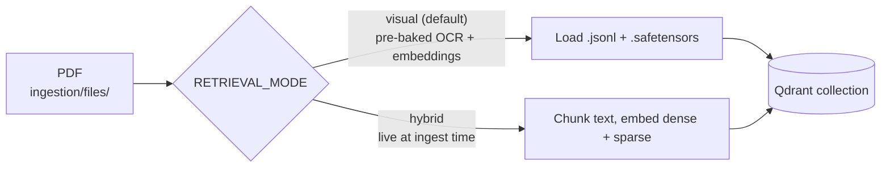
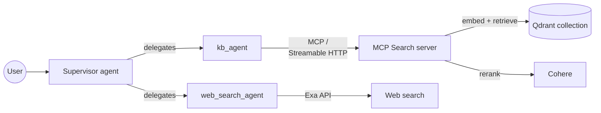

# Multi-Agent RAG + Web Search

A multi-agent **Agentic RAG** system built on Google's **ADK**: a supervisor agent that delegates to
a **knowledge-base agent** (RAG over your own documents, via an **MCP Search sidecar** backed by
**Qdrant**) and a **web-search agent** (via **Exa**) for anything outside the knowledge base —
deployable locally with Docker Compose or as a two-container service on **Cloud Run**.

> 🪟 **On Windows?** This README and the `docs/` guides use bash/zsh. A full PowerShell edition lives
> in **[`README_powershell.md`](README_powershell.md)** (with
> [`docs/local_deployment_powershell.md`](docs/local_deployment_powershell.md) and
> [`docs/gcp_deployment_powershell.md`](docs/gcp_deployment_powershell.md)).

**1. Ingestion (offline, one-time or on demand) — loads a PDF into Qdrant:**



**2. Runtime — answering a question:**



Both agents' LLM calls also go through **Cohere**. Two things run alongside this on every request but
aren't drawn above to keep the flow readable: **sessions** persist to Postgres locally / Cloud SQL in
production, and every run is **traced** via OpenTelemetry + OpenInference to Phoenix (local) or
Langfuse (production).

*Local `docker-compose` mirrors this exactly (its own `qdrant` + `postgres` + `phoenix`); the Cloud
Run deploy swaps in Qdrant Cloud, Cloud SQL, and Langfuse — see [What changes when you go from local
to cloud](#what-changes-when-you-go-from-local-to-cloud) below.*

## Highlights

- ✅ **Multi-agent orchestration** — a supervisor (`general_assistant`) routes each question to
  `kb_agent` (internal documents) or `web_search_agent` (the open web), and synthesizes the answer.
  Routing is topic-agnostic: swap in any document set and the agent adapts without a prompt rewrite.
- ✅ **Bilingual RAG out of the box** — ships with a real-world Arabic/English finance document (a UAE
  Central Bank quarterly report) pre-ingested via page-image multimodal embeddings + OCR, so
  retrieval and citation work across both languages from the first run. See
  [`ingestion/files/`](ingestion/files/) and [`questions.txt`](questions.txt) for sample bilingual
  queries. Swap in your own PDF any time (see [Ingesting your own documents](#ingesting-your-own-documents)).
- ✅ **Two retrieval modes** — `visual` (page-image embeddings + pre-baked OCR, the default) and
  `hybrid` (live dense + BM25 sparse fusion over extracted text) — pick per-document via
  `RETRIEVAL_MODE`.
- ✅ **Observability** — ADK traces via **OpenTelemetry + OpenInference**: **Phoenix** for local dev
  (free, on by default) and **Langfuse** for production. Same agent code, swap the endpoint.
- ✅ **Evaluation** — a `pytest` suite in [`eval/`](eval/) scoring both the **trajectory** (did it take
  the right path?) and the **final response** (grounded? correct?), plus a **regression gate**
  (`make gate`) so a change that makes the agent worse fails loudly instead of shipping.
- ✅ **Portable by design** — one agent image, local `docker-compose` or Cloud Run; only env vars change.

## What's in this repo

```
.
├── README.md                 ← you're reading it (overview)
├── README_powershell.md      ← Windows / PowerShell edition
├── Makefile                  ← local docker-compose workflow + trace + eval targets
├── .env.example              ← template — copy to .env and fill in your own keys
├── docker-compose.yml        ← local dev: agent + mcp + qdrant + postgres + ingestion (+ phoenix profile)
├── service.yaml.template     ← Cloud Run manifest template: one service, two containers (agent + mcp sidecar)
├── pytest.ini                ← pytest config for the eval suite
├── docs/
│   ├── local_deployment.md       ← step-by-step local stack + tracing + verify + eval  (bash)
│   ├── gcp_deployment.md          ← Cloud Run deploy + observability + online eval (bash)
│   ├── local_deployment_powershell.md
│   ├── gcp_deployment_powershell.md
│   ├── observability_concepts.md ← concepts: the telemetry stack (OTel, OTLP, OpenInference) + glossary
│   └── evaluation_concepts.md    ← concepts: offline gates, online scoring & the eval metrics
├── agent/                    ← the ADK agent (its own image)
│   ├── Dockerfile            ← agent image (uv-based)
│   ├── pyproject.toml        ← agent deps + observability; the [eval] extra (host tooling)
│   ├── main.py               ← FastAPI entrypoint; calls init_observability()
│   └── src/
│       ├── agent.py          ← supervisor + kb_agent + web_search_agent
│       ├── exa_tool.py       ← web search tool
│       └── observability.py  ← OpenInference → OTLP wiring
├── mcp/                      ← the Streamable-HTTP MCP Search server (its own image)
│   ├── Dockerfile
│   ├── pyproject.toml
│   └── ...
├── ingestion/                ← Cloud Run Job that loads the corpus into Qdrant
│   └── files/                ← the PDF + pre-baked OCR/embeddings (the bilingual demo doc ships here)
└── eval/                     ← the evaluation suite + regression gate (see eval/README.md)
```

## The system

One Cloud Run **service**, two **containers** (separate images) sharing `localhost`:

- **agent** — the supervisor (`general_assistant`) delegating to **`kb_agent`** and
  **`web_search_agent`**, on port 8080.
- **mcp** — the Search server (`search_article` over Qdrant), reached by the agent at
  `MCP_SERVER_URL` (`http://localhost:3000/mcp` in the same pod).

Plus Cloud SQL (sessions), Secret Manager (keys), Qdrant (vectors), Cohere (LLM + embeddings),
Exa (web). Locally, `docker-compose` mirrors this exactly: `agent` + `mcp` + a local `qdrant` +
`postgres` + a one-shot `ingestion` job.

> New to the telemetry vocabulary (OTel, OTLP, OpenInference)? See
> [`docs/observability_concepts.md`](docs/observability_concepts.md) — a short explainer + glossary
> (the wiring itself is in [`agent/src/observability.py`](agent/src/observability.py)).

## Prerequisites

1. A Google Cloud account with billing enabled, and the **gcloud CLI** (only needed for the Cloud Run deploy).
2. **Docker Desktop** running locally.
3. A **Cohere API key** — <https://dashboard.cohere.com/> — the agent's model + embeddings.
4. An **Exa API key** — <https://dashboard.exa.ai/> — the web-search tool.
5. A **Qdrant Cloud** cluster for the cloud deploy (local dev uses the Qdrant container).
6. **[uv](https://docs.astral.sh/uv/)** — the Python package manager, needed to **run the eval suite**
   on your host (`make eval-deps` uses it to build an isolated `.venv`). Install once:
   `curl -LsSf https://astral.sh/uv/install.sh | sh` (macOS/Linux, or `brew install uv`) — see the
   [install docs](https://docs.astral.sh/uv/getting-started/installation/). *(Not needed for the
   deploy itself — the Docker build carries its own uv; this is only for local eval.)*
7. *(Optional)* a **Gemini API key** — <https://aistudio.google.com/apikey> — for the LLM-judge
   eval criteria. The judge model is independent of the Cohere agent.
8. *(Optional)* a free **Langfuse** project — for production tracing + online evaluation.

## Setup (one-time)

Copy the env template and fill in your own values — **don't edit `.env.example` directly**:

```bash
cp .env.example .env
# then edit .env and replace every placeholder
```

Load it into your shell so `docker compose`, `gcloud`, and `make` all inherit it:

```bash
set -a; source .env; set +a
```

> 💡 **New terminal later?** Re-run `set -a; source .env; set +a` — env vars don't persist across shells.

## Run it

Two paths. **Run it locally first** — same image, same code, just on your laptop. You'll catch
missing env vars and broken imports in seconds instead of waiting for a Cloud Build.

### Locally with `docker-compose`

See **[`docs/local_deployment.md`](docs/local_deployment.md)** — `make up`, talk to it at `/dev-ui`,
turn on local **Phoenix** tracing, run the **eval suite**, tear down.

### On Google Cloud Run

See **[`docs/gcp_deployment.md`](docs/gcp_deployment.md)** — every `gcloud` command spelled out:
APIs, Cloud SQL, secrets, IAM, build, ingest, deploy the two-container service, production tracing,
and online evaluation.

## Ingesting your own documents

The knowledge base isn't tied to any specific document — drop a PDF into `ingestion/files/` and point
`.env` at it:

```bash
# "visual" mode (default) needs pre-baked OCR + embeddings (see ingestion/main.py for the format);
# "hybrid" mode just needs the raw PDF and does everything live at ingest time — the easier path
# for a document you haven't pre-processed.
RETRIEVAL_MODE=hybrid
INGEST_PDF_FILENAME=your_document.pdf

make ingest   # or: docker compose up ingestion
```

The two modes write to separate Qdrant collections (name-suffixed by mode), so switching is safe.
`kb_agent`'s routing logic doesn't hardcode a topic, so it adapts to whatever's ingested — but the
**eval suite's golden answers** (`eval/fixtures_judge/report_qa.evalset.json`) are written against
specific document content, so update those cases when you swap corpora (see
[`eval/README.md`](eval/README.md)).

## Observability & evaluation at a glance

- **Tracing** is governed by one env toggle (`OBSERVABILITY_ENABLED` + an OTLP endpoint).
  **Local dev → Phoenix:** it's **on by default** — `make up` starts the stack *and* a Phoenix UI,
  with the agent already exporting to it (local guide §3); set `OBSERVABILITY_ENABLED=false` to opt out.
  **Production → Langfuse (required):** the Cloud Run `service.yaml` ships with the same toggle on,
  pointed at Langfuse, so the deploy needs a Langfuse secret (deploy guide Steps 3b + 11). Same agent
  code; only the endpoint changes. The trace shows the supervisor → `transfer_to_agent` → the
  sidecar's `search_article` → synthesis.
- **Evaluation** lives in [`eval/`](eval/) — see [`eval/README.md`](eval/README.md). Bring the stack
  up with **`make up`** (tracing on, so eval runs land in Phoenix), then score the running system:
  **`make eval`** (fast deterministic suite) and **`make gate`** (regression gate), or **`make
  eval-judge`** / **`make gate-judge`** to add the Gemini-judge suite over the grounded evalset.
  Wire the same commands into CI (e.g. GitHub Actions) to gate every push/PR automatically.
- **Online evaluation** scores **live traffic** (not fixtures) in **production**: **Langfuse**'s
  managed **Context Relevance** evaluator samples incoming traces and scores **retrieval relevance**
  (are the chunks `search_article` retrieved relevant to the query?) on real sessions
  automatically — no script, no judge call in the request path. It's set up at the end of the cloud
  deploy — see [`docs/gcp_deployment.md`](docs/gcp_deployment.md) **Step 12** (online eval lives in
  its own section there). (Online eval is a production concern, so there's no local version — locally
  you only have your own dev-UI clicks.)

## Evaluation: judge on Vertex AI (and free-tier fallback)

The eval suite drives two **rate-limited** providers — the Cohere agent and the Gemini judge — so the
defaults are tuned to keep `make eval-judge` / `gate-judge` runnable.

**Gemini judge → Vertex AI (the configured default).** Google's *AI-Studio* free tier is brutal:
~**20 requests per DAY** for `gemini-2.5-flash` (quota `GenerateRequestsPerDayPerProjectPerModel-FreeTier`),
which a single `num_samples=5` run exhausts in one shot. So the judge is pointed at **Vertex AI**
instead, which bills to your GCP project / free-trial credits and has production-scale quota. Config
lives in `.env`:

```bash
GOOGLE_GENAI_USE_VERTEXAI=TRUE
GOOGLE_CLOUD_PROJECT=<your-project-id>
GOOGLE_CLOUD_LOCATION=us-central1
```

Auth is via Application Default Credentials — run this once (and re-run if you see a `RefreshError`):

```bash
gcloud auth application-default login
gcloud services enable aiplatform.googleapis.com   # one-time, enables Vertex AI on the project
```

The eval host loads `.env` itself (via `eval/_envload.py`), so you don't need to `source .env` first.
With Vertex, the judge uses the full config — `gemini-2.5-flash`, `num_samples: 5`.

**Cohere agent → client-side rate limit.** Trial keys cap at **20 requests/min**. The agent's
`LiteLlm` wrapper has a sliding-window limiter, **off by default** (production on a paid key runs full
speed); the `make eval*` / `gate*` targets switch it on via `LLM_MAX_RPM` (default `18`). On a paid
Cohere key: `make eval-judge LLM_MAX_RPM=0`.

**Small judge set on purpose.** `make eval-judge` runs `report_qa.evalset.json` (a handful of
happy-path cases, scored by `final_response_match_v2` only — reliably green) — kept small not for
Gemini quota (Vertex has plenty) but because the **Cohere agent** is slow and rate-limited.
Groundedness (`hallucinations_v1`) is **opt-in** (it's flaky — returns NOT_EVALUATED on a hiccup);
enable it via the `_groundedness_optin` block in `eval/fixtures_judge/test_config.json`. Need heavier
coverage? Add cases or point `JUDGE_DATASET` at your own evalset.

**Free-tier fallback (no GCP billing).** Set `GOOGLE_GENAI_USE_VERTEXAI=FALSE` + a `GOOGLE_API_KEY`
in `.env` to use AI Studio instead — but mind the ~20 req/day cap: you'd want `num_samples: 1` and a
small dataset, and you'll typically get one run/day.

## What changes when you go from local to cloud

The agent code does not change — env vars route to the right backends.

| | Local (`docker-compose`) | Cloud Run |
|---|---|---|
| MCP transport | `agent` → `mcp` container (`http://mcp:3000/mcp`) | `agent` → `mcp` sidecar (`http://localhost:3000/mcp`) |
| Vector store | local `qdrant` container | **Qdrant Cloud** |
| Sessions | local `postgres` container | **Cloud SQL** (Auth Proxy socket) |
| Keys | `.env` → docker-compose | **Secret Manager** → Cloud Run |
| Tracing backend | **Phoenix** (compose service, on by default with `make up`) | **Langfuse** — required (deploy guide Steps 3b + 11) |
| Online eval | — (not run locally) | Langfuse UI online evaluators (managed) |

**One agent image. Two configurations. That's portable infrastructure.**

## Roadmap / not yet wired up

- 🔜 **CI/CD** — the eval commands above run by hand today; wiring them into GitHub Actions (with
  branch protection gating merges on `make gate`) is a natural next step.
- 🔜 **Auth on the endpoint** — currently deploys public; real auth (IAP/OAuth) would be needed before
  handling sensitive data in production.
